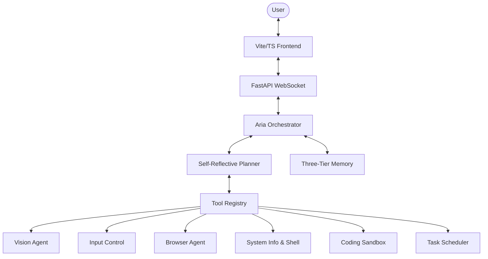

<div align="center">
  
  <h1>A.R.I.A.</h1>
  <p><b>Adaptive Responsive Intelligence Assistant</b></p>
  <p><i>The God-Level AI Agent for your Local System</i></p>

  <a href="https://github.com/your-username/aria/blob/main/LICENSE">
    
  </a>
  <a href="https://www.python.org/">
    
  </a>
  <a href="https://reactjs.org/">
    
  </a>
</div>

<br>

A.R.I.A. is an advanced, fully autonomous AI assistant capable of deep-level PC control, dynamic coding, headless browser automation, vision-guided interactions, and long-term contextual memory. Inspired by JARVIS, A.R.I.A. features a high-fidelity TypeScript frontend backed by a powerful, modular Python/FastAPI backend and 60+ integrated desktop tools.

---

## ⚡ Core Capabilities

ARIA is built on an agentic architecture featuring a self-reflective planning loop, meaning she can evaluate her own plans before executing them and iteratively correct her course.

### 👁️ God-Level Vision & Control
- **Vision-Guided Interaction**: Natural language UI control. Tell ARIA to `"click the submit button"` and she will analyze the screen, locate the element, and click it natively. 
- **Desktop Automation**: Full mouse and keyboard control, window management (minimize, maximize, focus), clipboard access, and background application launching.
- **Document Reading**: Reads and analyzes PDF, DOCX, and PPTX files directly using Vision AI by rendering pages to images.

### 🧠 Three-Tier Memory Architecture
- **Working Memory**: In-memory context for the current session.
- **Episodic Memory**: ChromaDB-powered RAG memory retains cross-session conversation history and tracks task outcomes.
- **Procedural Memory**: SQLite-backed system for learning workflows, establishing system norms, and maintaining persistent schedules.

### 🌐 Headless Browser Agent
- **Playwright Automation**: Autonomously navigate the web, research topics, click elements, fill forms, and interact with complex web UIs—all invisibly in the background.

### 💻 Advanced Coding Sandbox
- **Dynamic Execution**: Execute Python and Node.js code dynamically in isolated sandboxes.
- **System Shell & File I/O**: Native shell execution and surgical file editing capabilities across your workspace.

### ⏰ Scheduler & Notifications
- **Autonomous Tasks**: Schedule cron jobs, intervals, or one-shot tasks (e.g., `"Run a system scan every night at midnight"`).
- **Multi-Channel Push**: ARIA can push the results of her autonomous tasks to you via Slack, Telegram, WhatsApp, Email, or Discord.

---

## 🏗️ Architecture

A.R.I.A is modular by design, allowing new tools and capabilities to be registered effortlessly. 



---

## 🚀 Getting Started

### Prerequisites
- **Python 3.10+**
- **Node.js 18+**
- `wmctrl`, `xdotool`, `xclip` (for full Linux desktop control)
- `libreoffice` (optional, for DOCX/PPTX to PDF rendering)

### 1. Backend Setup

```bash
# Clone the repository
git clone https://github.com/your-username/aria.git
cd aria

# Create and activate a virtual environment
python3 -m venv .venv
source .venv/bin/activate

# Install Python dependencies
pip install -r requirements.txt

# Install Playwright browsers (for the Browser Agent)
playwright install chromium

# Copy environment variables and fill them out
cp .env.example .env
```
*(Make sure to configure your LLM provider and notification tokens in `.env`)*

### 2. Frontend Setup

```bash
cd ui
npm install
npm run dev
```

### 3. Run ARIA

Start the FastAPI backend server:
```bash
# From the root directory
python3 server.py
```
Open your browser to `http://localhost:5173` (or the port specified by Vite) to interact with ARIA!

---

## 📚 Documentation

For deep dives into ARIA's internals, please refer to the documentation:
- [Architecture & Design Details](docs/architecture.md)
- [Getting Started & Configuration Guide](docs/getting_started.md)

---

## 🤝 Contributing

We welcome contributions! Whether it's adding new tools, improving the frontend, or refining the agentic loop, your help is appreciated. 

Please see our [Contributing Guidelines](CONTRIBUTING.md) to get started.

---

## ⚖️ License

This project is licensed under the MIT License - see the [LICENSE](LICENSE) file for details.